# CLI Codegen Roadmap

> **Scope**: This document covers only the CLI package (`packages/cli`). It starts
> from the current state, identifies every gap, and defines the end-state where
> `codegen` owns the entire CLI surface area — every action group, every resource,
> every handler, every i18n string block, and every test file.

---

## Table of Contents

1. [Current State Audit](#1-current-state-audit)
2. [Target Architecture](#2-target-architecture)
3. [Gap Analysis](#3-gap-analysis)
4. [Implementation Phases](#4-implementation-phases)
   - [Phase 1 — Generic resource definition template](#phase-1--generic-resource-definition-template) ✅
   - [Phase 2 — Generic per-resource handler template](#phase-2--generic-per-resource-handler-template) ✅
   - [Phase 3 — Dynamic group definition children list](#phase-3--dynamic-group-definition-children-list) ✅
   - [Phase 4 — Bring open / close under codegen](#phase-4--bring-open--close-under-codegen) ✅
   - [Phase 5 — Bring all remaining action groups under codegen](#phase-5--bring-all-remaining-action-groups-under-codegen)
   - [Phase 6 — i18n strings fully driven by spec](#phase-6--i18n-strings-fully-driven-by-spec)
   - [Phase 7 — Generic test templates for all patterns](#phase-7--generic-test-templates-for-all-patterns)
5. [Template Inventory — Before & After](#5-template-inventory--before--after)
6. [Data-flow Diagrams](#6-data-flow-diagrams)
7. [Spec Schema Extensions Required](#7-spec-schema-extensions-required)
8. [File-ownership Matrix](#8-file-ownership-matrix)
9. [Migration Strategy](#9-migration-strategy)
10. [Acceptance Criteria](#10-acceptance-criteria)

---

## 1. Current State Audit

> **Updated after Phases 1–4 completion** — the table below reflects post-PR state.

### What codegen owns (CLI) — after Phases 1–4

| File | Template | Notes |
|---|---|---|
| `src/common/LocalFileHandler.ts` | `cli/localfile.handler.hbs` | Shared multi-action handler for CICSLocalFile (Pattern A) |
| `src/-strings-/en.ts` | `cli/en.ts.hbs` | Full i18n strings file (static template, spec-driven in Phase 6) |
| `src/enable/Enable.definition.ts` | `cli/group.definition.hbs` | Dynamic children list — loops over spec imports |
| `src/enable/localFile/LocalFile.definition.ts` | `cli/localfile.definition.hbs` | All names/aliases derived from spec |
| `src/enable/urimap/Urimap.definition.ts` | `cli/resource.definition.hbs` | ✨ **New** — generic definition template |
| `src/enable/urimap/Urimap.handler.ts` | `cli/resource.handler.hbs` | ✨ **New** — generic Pattern B handler |
| `src/disable/Disable.definition.ts` | `cli/group.definition.hbs` | Dynamic children list |
| `src/disable/localFile/LocalFile.definition.ts` | `cli/localfile.definition.hbs` | All names/aliases derived from spec |
| `src/disable/urimap/Urimap.definition.ts` | `cli/resource.definition.hbs` | ✨ **New** |
| `src/disable/urimap/Urimap.handler.ts` | `cli/resource.handler.hbs` | ✨ **New** |
| `src/open/Open.definition.ts` | `cli/group.definition.hbs` | ✨ **New** — `open` group now codegen-owned |
| `src/open/localFile/LocalFile.definition.ts` | `cli/localfile.definition.hbs` | ✨ **New** — replaces `OpenLocalFile.ts` |
| `src/close/Close.definition.ts` | `cli/group.definition.hbs` | ✨ **New** — `close` group now codegen-owned |
| `src/close/localFile/LocalFile.definition.ts` | `cli/localfile.definition.hbs` | ✨ **New** — replaces `CloseLocalFile.ts` |
| **Tests** | | |
| `__tests__/__unit__/enable/localFile/LocalFile.handler.unit.test.ts` | `tests/cli.localfile.handler.unit.test.hbs` | Pattern A handler test |
| `__tests__/__unit__/disable/localFile/LocalFile.handler.unit.test.ts` | `tests/cli.localfile.handler.unit.test.hbs` | Pattern A handler test |
| `__tests__/__unit__/open/localFile/LocalFile.handler.unit.test.ts` | `tests/cli.localfile.handler.unit.test.hbs` | ✨ **New** |
| `__tests__/__unit__/close/localFile/LocalFile.handler.unit.test.ts` | `tests/cli.localfile.handler.unit.test.hbs` | ✨ **New** |
| `__tests__/__unit__/enable/Enable.definition.unit.test.ts` | `tests/cli.group.definition.unit.test.hbs` | Checks children count |
| `__tests__/__unit__/disable/Disable.definition.unit.test.ts` | `tests/cli.group.definition.unit.test.hbs` | Checks children count |
| `__tests__/__unit__/open/Open.definition.unit.test.ts` | `tests/cli.group.definition.unit.test.hbs` | ✨ **New** |
| `__tests__/__unit__/close/Close.definition.unit.test.ts` | `tests/cli.group.definition.unit.test.hbs` | ✨ **New** |

### What is manually maintained (not yet owned by codegen)

| File pattern | Action group | Notes |
|---|---|---|
| `src/define/*` | define | 5 resources: Bundle, Program, Transaction, 3× URIMap variants, WebService |
| `src/delete/*` | delete | Program, Transaction, URIMap, WebService |
| `src/discard/*` | discard | Program, Transaction, URIMap |
| `src/install/*` | install | Program, Transaction, URIMap |
| `src/refresh/*` | refresh | Program |
| `src/get/*` | get | Generic resource handler |
| `src/add-to-list/*` | add-to-list | CSDGroup |
| `src/remove-from-list/*` | remove-from-list | CSDGroup |
| `src/enable/urimap/Urimap.handler.unit.test.ts` | enable | Hand-written handler test; spy name aligned to generated handler |
| `src/disable/urimap/Urimap.handler.unit.test.ts` | disable | Same |

### Handler patterns observed in the codebase

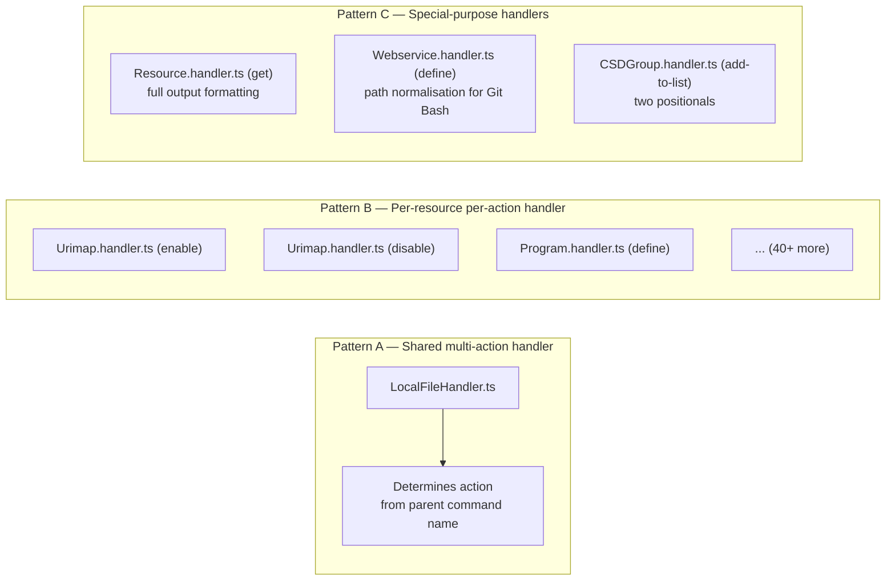

---

## 2. Target Architecture

The end-state is a codegen system that generates **every** CLI file from templates and
the spec. The only hand-maintained files are the four static files listed below.

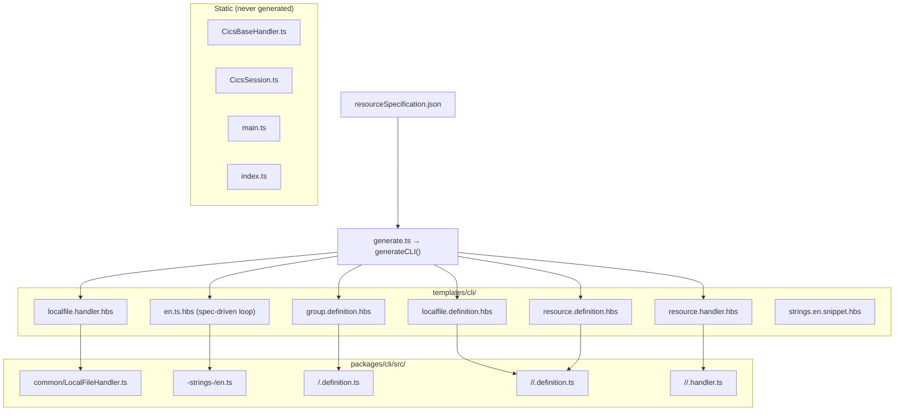

---

## 3. Gap Analysis

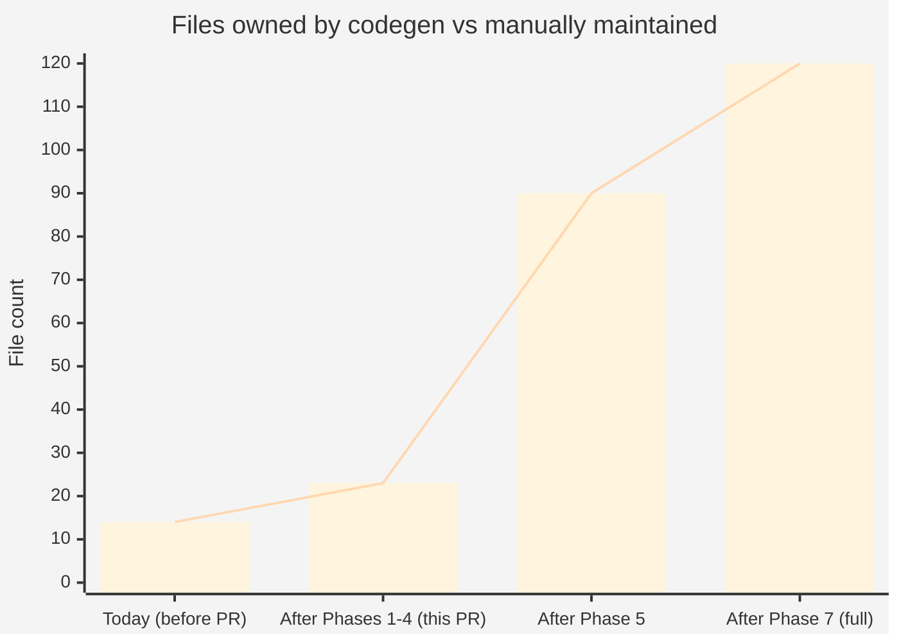

| Metric | Before this PR | After this PR | After Phase 5 | Full (Phase 7) |
|---|---|---|---|---|
| CLI source files owned by codegen | 8 | 14 | ~90 | ~100 |
| CLI test files owned by codegen | 4 | 8 | ~30 | ~50 |
| Action groups fully owned | 2 | 4 | 8 | 8 |
| Resources fully owned | 1 | 2 | ~10 | ~10 |

---

## 4. Implementation Phases

### Phase 1 — Generic resource definition template ✅ COMPLETE

**Goal**: Replace `localfile.definition.hbs` with a single `resource.definition.hbs`
that renders once per `(resource, action-group)` pair and reads all names, aliases,
positionals, options, and example strings from the spec.

#### What changed

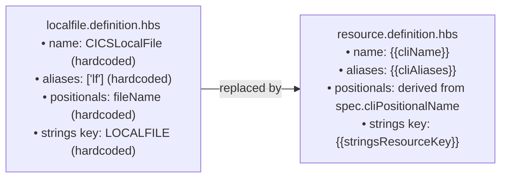

**Delivered**:
- `codegen/templates/cli/resource.definition.hbs` — new generic definition template
- `codegen/templates/cli/localfile.definition.hbs` — updated to use spec context variables (no hardcoded names)
- `codegen/generate.ts` — new `generateCLI()` method with `CLIResourceEntry` context builder
- `codegen/resourceSpecification.json` — `cliName`, `cliDir`, `cliClass`, `cliAliases`, `cliPositionalName` fields added to `CICSLocalFile` and `CICSURIMap`

---

### Phase 2 — Generic per-resource handler template ✅ COMPLETE

**Goal**: Create `resource.handler.hbs` that generates a Pattern B handler —
one class, one SDK call, one action — for every `(resource, action-group)` pair.
This replaces the hand-written `Urimap.handler.ts`.

#### Two handler strategies

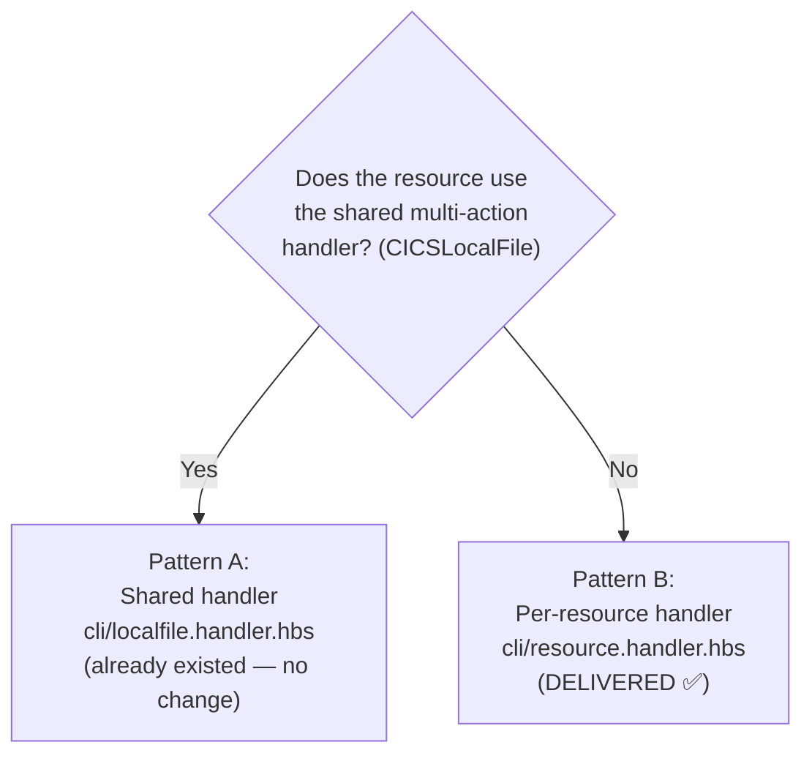

**Delivered**:
- `codegen/templates/cli/resource.handler.hbs` — new generic Pattern B handler template
- `codegen/resourceSpecification.json` — `useSharedHandler: true` on `CICSLocalFile`; `noCicsPlex: true` + explicit `sdkFunction` overrides on URIMap actions
- `codegen/generate.ts` — `generateCLI()` branches on `entry.useSharedHandler` to choose Pattern A vs B

---

### Phase 3 — Dynamic group definition children list ✅ COMPLETE

**Goal**: Remove the hardcoded `[LocalFileDefinition, UrimapDefinition]` from
`group.definition.hbs` and replace it with a loop over all resources that have
a definition for that action group.

#### What changed

**Before**:
```typescript
// group.definition.hbs — hardcoded:
children: [LocalFileDefinition, UrimapDefinition],
```

**After**:
```handlebars
{{!-- group.definition.hbs — dynamic loop --}}
{{#each imports}}
import { {{exportName}} } from "./{{dir}}/{{file}}";
{{/each}}
...
children: [{{#each imports}}{{exportName}}{{#unless @last}}, {{/unless}}{{/each}}],
```

**Delivered**:
- `codegen/templates/cli/group.definition.hbs` — updated to loop over `imports[]`
- `codegen/generate.ts` — builds `imports` array from `groupMap` entries
- `codegen/resourceSpecification.json` — `groupMeta` section added with `enable`, `disable`, `open`, `close` entries

---

### Phase 4 — Bring open / close under codegen ✅ COMPLETE

**Goal**: Generate `open` and `close` group definitions and `LocalFile.definition.ts`
from the same templates used by `enable` and `disable`. Delete the manually-maintained
`OpenLocalFile.ts` and `CloseLocalFile.ts`.

#### What was done

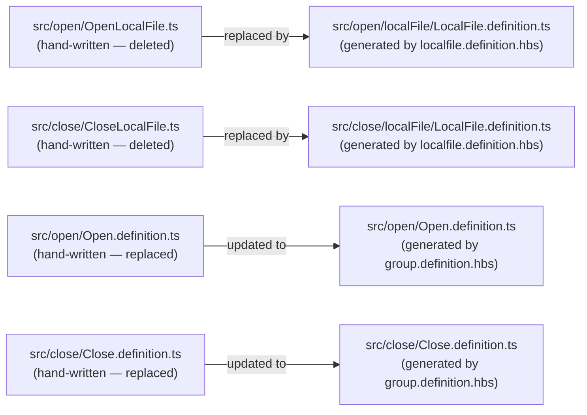

**Delivered**:
- `src/open/Open.definition.ts` and `src/close/Close.definition.ts` — now generated
- `src/open/localFile/LocalFile.definition.ts` and `src/close/localFile/LocalFile.definition.ts` — new generated files
- `src/open/OpenLocalFile.ts` and `src/close/CloseLocalFile.ts` — **deleted** (codegen-owned replacements exist)
- `__tests__/__unit__/open/Open.definition.unit.test.ts` and `__tests__/__unit__/close/Close.definition.unit.test.ts` — now generated
- `__tests__/__unit__/open/localFile/LocalFile.handler.unit.test.ts` and `__tests__/__unit__/close/localFile/LocalFile.handler.unit.test.ts` — now generated

---

### Phase 5 — Bring all remaining action groups under codegen

**Goal**: Model `discard`, `install`, `define`, `delete`, `refresh`, `get`,
`add-to-list`, and `remove-from-list` in `resourceSpecification.json` and delete
all hand-written files in those directories.

#### Spec modelling work

Each action group and its per-resource variants must be described in the spec.
The table below shows the minimum additions required:

| Action group | New `actions` section entry | Resources to add actions to |
|---|---|---|
| `discard` | `DISCARD` shared action | `CICSProgram`, `CICSURIMap`, add `CICSTransaction` |
| `install` | `INSTALL` shared action | `CICSProgram`, `CICSURIMap`, add `CICSTransaction` |
| `refresh` | `REFRESH` shared action | `CICSProgram` |
| `delete` | `DELETE` shared action | `CICSProgram`, `CICSURIMap`, add `CICSTransaction`, `CICSWebService` |
| `define` | `DEFINE` action (may need sub-types for URIMap variants) | `CICSProgram`, `CICSURIMap`, add `CICSTransaction`, `CICSWebService`, `CICSBundle` |
| `get` | `GET` action — special generic handler | New `CICSResource` meta-resource |
| `add-to-list` | `ADD_TO_LIST` action | New `CICSCSDGroup` resource |
| `remove-from-list` | `REMOVE_FROM_LIST` action | New `CICSCSDGroup` resource |

New resources that need to be added to the spec:

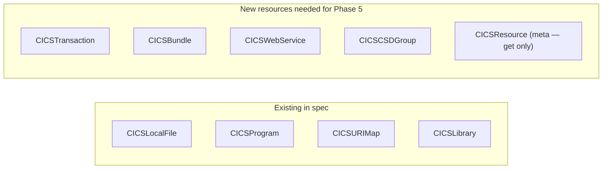

#### URIMap `define` sub-types

The `define` action for URIMap has three variants (`urimap-server`, `urimap-client`,
`urimap-pipeline`). Each variant is a separate CLI sub-command with its own options
and handler. Modelling these requires a `variants` array on the action reference:

```json
{
  "identifier": { "name": "DEFINE", "group": "define", ... },
  "variants": ["server", "client", "pipeline"],
  "variantOptions": {
    "server": ["PATH", "HOST", "SCHEME", "PROGRAMNAME", "TCPIPSERVICE", "DESCRIPTION", "ENABLEATTR"],
    "client": ["PATH", "HOST", "SCHEME", "AUTHENTICATE", "CERTIFICATE", "DESCRIPTION", "ENABLEATTR"],
    "pipeline": ["PATH", "HOST", "SCHEME", "PIPELINENAME", "TRANSACTIONNAME", "WEBSERVICENAME", "DESCRIPTION", "ENABLEATTR"]
  }
}
```

---

### Phase 6 — i18n strings fully driven by spec

**Goal**: Remove the static monolithic `en.ts.hbs` template and replace it with a
spec-driven generator that emits exactly the i18n keys each resource and action
requires — nothing more, nothing less.

#### Current problem

`en.ts.hbs` is a ~610-line static TypeScript file embedded in a template. Every
time a new resource or action group is added, the template body must be manually
edited. There is no loop over spec resources.

#### Target

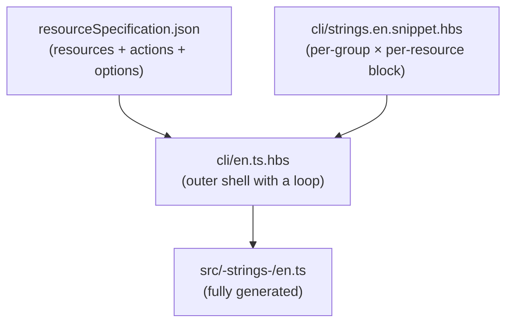

The outer `en.ts.hbs` loops over all action groups and all resources within each
group, including the snippet partial for each:

```handlebars
export default {
  {{#each actionGroups}}
  {{toUpperCase this.name}}: {
    SUMMARY: "...",
    DESCRIPTION: "...",
    RESOURCES: {
      {{#each this.resources}}
      {{> strings.en.snippet resource=this action=../this}}
      {{/each}}
    },
  },
  {{/each}}
};
```

The snippet partial (`strings.en.snippet.hbs`) owns the
`DESCRIPTION / POSITIONALS / OPTIONS / MESSAGES / EXAMPLES` block for one
`(resource, action-group)` pair and reads all text from new `strings` fields on
the spec.

#### Spec additions required

Each resource action requires a `strings` object:

```json
{
  "identifier": { "name": "DISCARD", "group": "discard", ... },
  "strings": {
    "description": "Discard a program from CICS.",
    "positionals": {
      "PROGRAMNAME": "The name of the program to discard..."
    },
    "options": {
      "REGIONNAME": "The CICS region name from which to discard the program",
      "CICSPLEX": "The name of the CICSPlex from which to discard the program"
    },
    "messages": {
      "SUCCESS": "The program '%s' was discarded successfully.",
      "PROGRESS": "Discarding program from CICS"
    },
    "examples": {
      "EX1": "Discard a program named PGM123 from the region named MYREGION"
    }
  }
}
```

Adding strings to the spec is the largest non-code work item in this phase —
but it eliminates the last category of manual edits to generated files.

---

### Phase 7 — Generic test templates for all patterns

**Goal**: Every generated `definition.ts` and `handler.ts` file has a corresponding
generated unit test. This phase adds the two missing test templates.

#### Current test coverage by template

| Template | Tests | Pattern |
|---|---|---|
| `tests/cli.localfile.handler.unit.test.hbs` | LocalFileHandler (Pattern A) | Shared multi-action handler |
| `tests/cli.group.definition.unit.test.hbs` | Group definition children count | Group definition |
| _(missing)_ | Pattern B per-resource handler | Per-action handler |
| _(missing)_ | Per-resource definition shape | Resource definition |

#### New templates

**`tests/cli.resource.handler.unit.test.hbs`** — Pattern B handler test:
- Mocks the SDK function via `jest.spyOn`
- Calls `handler.process(params)` with required positional + `regionName`
- Asserts the SDK function was called with the correct session and parms
- If the action has `additionalOptions`, asserts those are forwarded

**`tests/cli.resource.definition.unit.test.hbs`** — Resource definition test:
- Loads the definition module
- Asserts `name`, `aliases`, `type`, and `positionals[0].name` match the spec
- Snapshot-tests the full definition object

#### Generator changes

After rendering each `<Resource>.handler.ts` (Phase 2), also render
`tests/cli.resource.handler.unit.test.hbs` into
`__tests__/__unit__/<group>/<resourceDir>/<Resource>.handler.unit.test.ts`.

After rendering each `<Resource>.definition.ts` (Phase 1), also render
`tests/cli.resource.definition.unit.test.hbs` into
`__tests__/__unit__/<group>/<resourceDir>/<Resource>.definition.unit.test.ts`.

---

## 5. Template Inventory — Before & After

```mermaid
block-beta
    columns 2

    block:before["Before (PR start)"]:2
        B1["localfile.handler.hbs\n(CICSLocalFile only)"]
        B2["localfile.definition.hbs\n(CICSLocalFile only, hardcoded names)"]
        B3["group.definition.hbs\n(hardcoded children list)"]
        B4["en.ts.hbs\n(static 595-line file)"]
        BT1["cli.localfile.handler.unit.test.hbs"]
        BT2["cli.group.definition.unit.test.hbs\n(enable + disable only)"]
    end

    block:after["After (PR merged — Phases 1–4 done)"]:2
        A1["localfile.handler.hbs\n(unchanged — CICSLocalFile)"]
        A2["localfile.definition.hbs\n(uses spec context vars ✅)"]
        A3["resource.definition.hbs ✅\n(generic — all Pattern B resources)"]
        A4["resource.handler.hbs ✅\n(generic — Pattern B)"]
        A5["group.definition.hbs\n(dynamic children loop ✅)"]
        A6["en.ts.hbs\n(static — spec-driven loop in Phase 6)"]
        AT1["cli.localfile.handler.unit.test.hbs\n(unchanged)"]
        AT2["cli.group.definition.unit.test.hbs\n(all 4 groups ✅)"]
    end
```

---

## 6. Data-flow Diagrams

### Generation sequence (current state — Phases 1–4 complete)

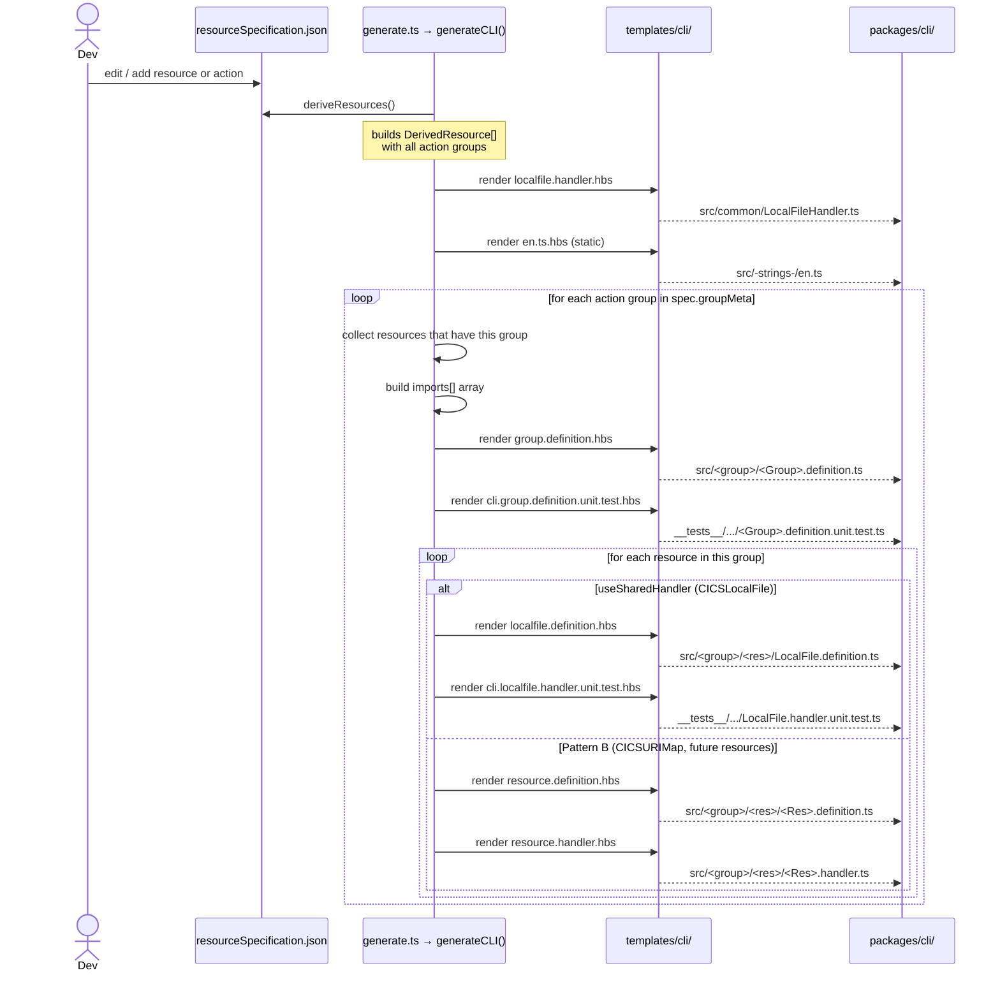

### Property derivation for CLI (current state)

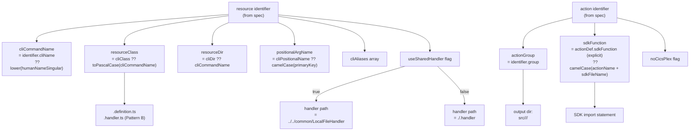

---

## 7. Spec Schema Extensions Required

The following additions to `resourceSpecification.schema.json` (and the
corresponding entries in `resourceSpecification.json`) are needed across phases:

| Field | Location | Type | Required | Purpose | Status |
|---|---|---|---|---|---|
| `identifier.cliName` | resource identifier | `string` | No | CLI command name when it differs from `lower(humanNameSingular)` | ✅ Done |
| `identifier.cliDir` | resource identifier | `string` | No | Subdirectory name inside the group dir | ✅ Done |
| `identifier.cliClass` | resource identifier | `string` | No | PascalCase class name override | ✅ Done |
| `identifier.cliAliases` | resource identifier | `string[]` | No | CLI command aliases | ✅ Done |
| `identifier.cliPositionalName` | resource identifier | `string` | No | camelCase name for the primary positional argument | ✅ Done |
| `identifier.useSharedHandler` | resource identifier | `boolean` | No | Signals Pattern A (shared handler) | ✅ Done |
| `action.noCicsPlex` | action reference | `boolean` | No | Omit `cics-plex` option from this action's definition | ✅ Done |
| `action.sdkFunction` | action reference | `string` | No | Explicit SDK function name override | ✅ Done |
| `groupMeta.<group>` | root | `object` | No | Aliases, summary, description, stringsKey for a group | ✅ Done |
| `action.strings` | action reference | `object` | No | i18n strings for `(resource, action)` pair (Phase 6) | ⏳ Phase 6 |
| `action.variants` | action reference | `string[]` | No | Sub-command variant names (URIMap define pattern) (Phase 5) | ⏳ Phase 5 |
| `action.variantOptions` | action reference | `Record<string, string[]>` | No | Options per variant (Phase 5) | ⏳ Phase 5 |

---

## 8. File-ownership Matrix

The table below shows each file or file pattern under `packages/cli/` and its
ownership status across phases.

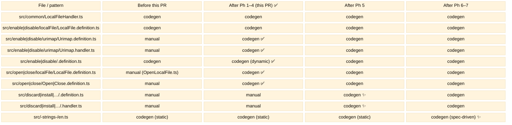

---

## 9. Migration Strategy

Each phase follows the same safe migration sequence to avoid breaking the CI check
(`npm run check:generated`) or the test suite:

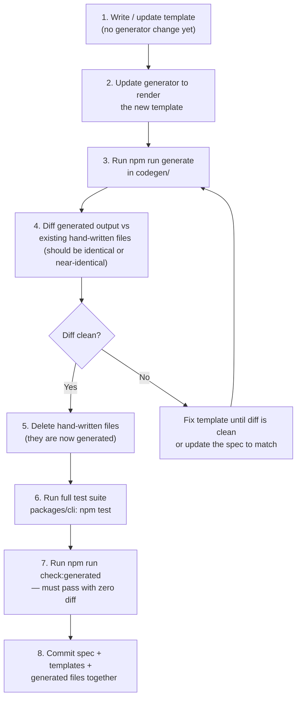

### Phase ordering rationale

Phases are ordered to minimise the risk window where some files are generated and
others are not:

1. **Phase 1** before **Phase 3**: the group definition template cannot loop over
   resource definitions that don't exist yet.
2. **Phase 2** before **Phase 4**: open/close will use the new definition template;
   without the handler template they would reference a non-existent file.
3. **Phase 5** last: it requires the spec to be fully extended with new resources
   and actions. Schema changes and spec additions are the highest-risk edits and
   benefit from all templates being proven correct on existing resources first.
4. **Phase 6** can run in parallel with Phase 5 (strings additions to the spec can
   be done resource-by-resource).
5. **Phase 7** can run in parallel with any other phase — test templates are
   additive and do not affect generation of source files.

---

## 10. Acceptance Criteria

A phase is complete when **all** of the following are true:

- [x] `npm run generate` (inside `codegen/`) runs without error
- [x] `npm run check:generated` passes with zero diff (generated files match committed files)
- [x] All 12 affected unit tests inside `packages/cli/__tests__/__unit__/` pass with no new failures
- [ ] `npm test` inside `packages/cli/` passes with no new failures (full suite — run before merge)
- [ ] No file under `packages/cli/src/` or `packages/cli/__tests__/` (excluding the four static files listed in §2) is manually maintained
- [ ] Adding a new resource to the spec and running `npm run generate` produces a fully functional CLI command with definition, handler, i18n strings, and unit tests — with zero manual edits required

### Phases 1–4 acceptance results

| Check | Result |
|---|---|
| `npm run generate` runs without error | ✅ |
| `npm run check:generated` zero diff | ✅ |
| `packages/cli` unit tests for enable/disable/open/close | ✅ 12 suites, 20 tests passing |
| `enableUrimap` / `disableUrimap` SDK function names correct | ✅ |
| `CicsCmciConstants.CICS_LOCAL_FILE_BUSY_VALUES` correct | ✅ |
| `open/OpenLocalFile.ts` and `close/CloseLocalFile.ts` deleted | ✅ |
| No out-of-scope files changed (SDK, define, delete, discard, …) | ✅ |
