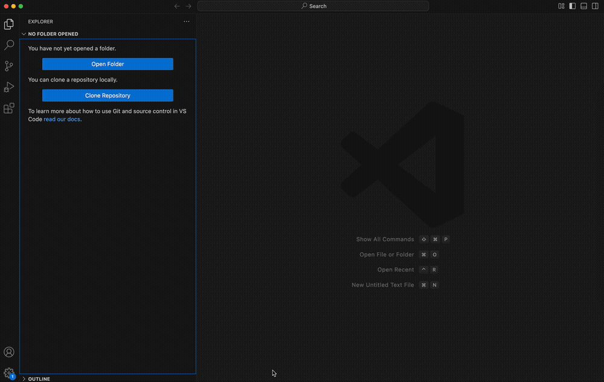

# IBM CICS for Zowe Explorer Extension Installation

## Requirements

- VS Code
- Zowe Explorer (optional - the Zowe Explorer will be added as part of the install if it isn't already present in VS Code.

## Installation

### From the VS Code Marketplace

1. Open the Extensions tab in the VS Code activity bar.
2. Search for `IBM CICS for Zowe Explorer`.
3. Click `Install`. (This will also install `Zowe Explorer` if not already present.).

You will now have the Zowe icon in the activity bar with a `CICS` section inside, alongside `Data Sets`, `Unit System Services (USS)` and `Jobs`.

### From VSIX File

1. Open the Extensions tab in the activity bar.
2. Click the `...` menu, and press **Install from VSIX...**.
3. Select the downloaded `Zowe.cics-extension-for-zowe-3.x.x.vsix` file.

 

The successfull install message should be shown in the bottom right

 

The Zowe Explorer pane will still show tree views for `Data Sets`, `Unit System Services (USS)` and `Jobs`, but in addition a new view `CICS` will be included.

 

